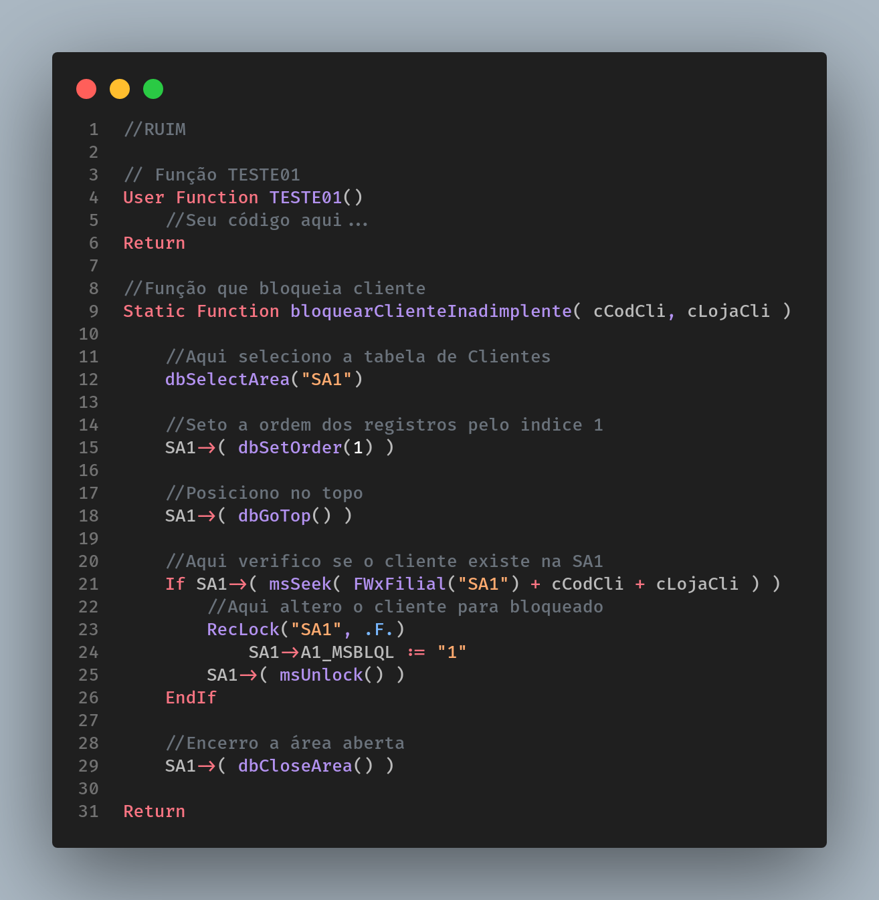
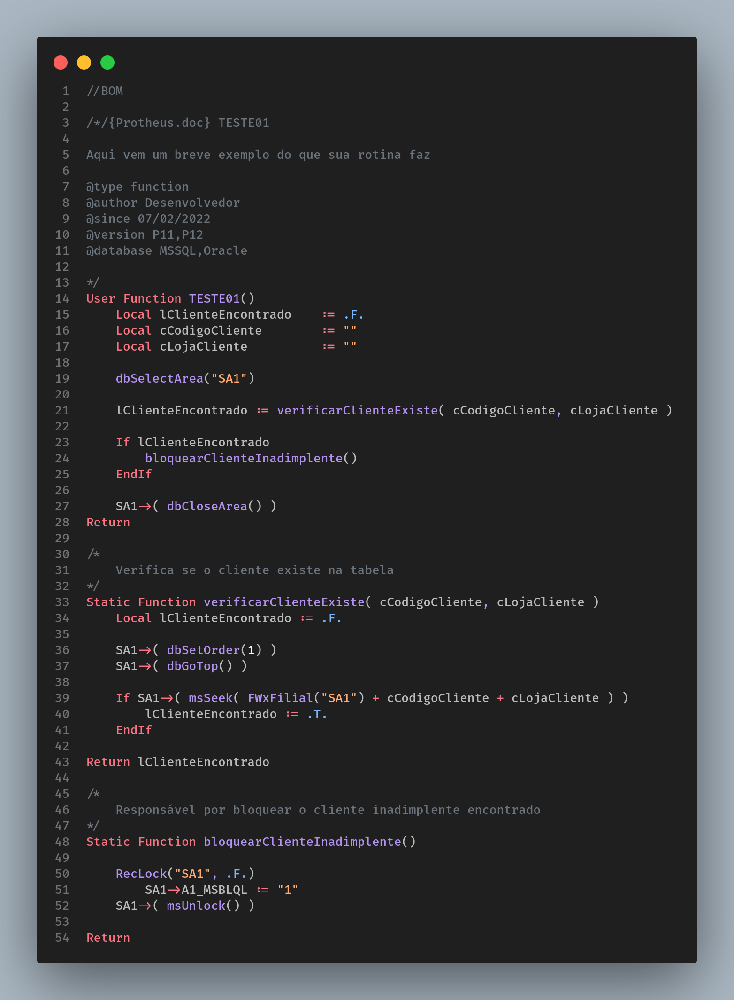

# Comentários [**<div style="font-size:12px; float: right; height:40px; display: flex; align-items:center">Voltar</div>**](../../README.md)

Uma função bem escrita deve ser autoexplicativa, ou seja, não necessita de muitos comentários. Lembrem-se, se uma função foi possui muitos comentários está na hora de revisa-la.

Aqui vão duas regras essenciais ao comentar rotinas em AdvPL:

1. Para _User Function_ sempre utilize o ProtheusDoc, preenchendo todas as informações obrigatórias. Maiores detalhes [**aqui**](https://tdn.totvs.com/display/tec/ProtheusDOC).

2. Para _Static Function_ utilize o seguinte padrão:

```
/*
  Seu comentário aqui
*/
```

Segue abaixo exemplos de como escrever e como **não** escrever comentários:

**Exemplo 1:**


**Exemplo 2:**


Apesar deste segundo exemplo ter ficado maior, podemos notar que as linhas não precisam do execesso de comentários como antes, pois as funções por si só comprometem-se a fazer apenas aquilo que lhes foi determinada.
