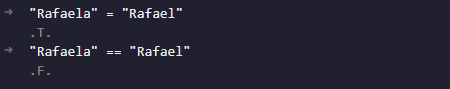

# Comparativo

No AdvPL temos dois tipos de comparativos: o “=” (igual) e o “==” (exatamente igual). Não recomendo o uso do primeiro pois em alguns casos de comparação de strings podemos ter um falso positivo (parcialmente verdadeiro).

No exemplo acima vimos que ao comparar dois valores, mas com operadores diferentes nosso resultado final também foi divergente? Esse é o caso de um retorno falso positivo. Por isso sempre optem pela utilização do estritamente igual (==) para não acarretar em maiores problemas em seu código e horas de sono perdida.
