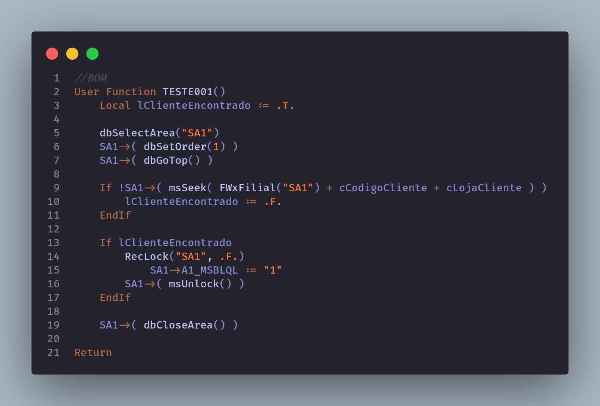

# dbSeek x msSeek

[Voltar](../../README.md)

Prefira sempre o uso do msSeek ao dbSeek. Conforme orientado pelo próprio [TDN](https://tdn.totvs.com/display/public/framework/Desempenho+DbSeek+x+MsSeek), pois o msSeek garante uma maior performance e você não precisa acessar novamente a base de dados para buscar uma informação que já está sendo utilizado pela conexão ativa.

