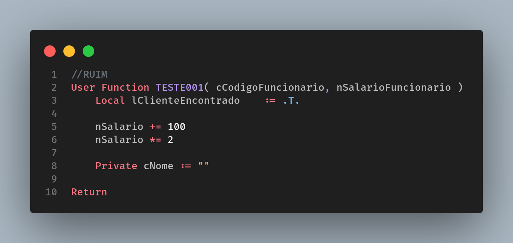
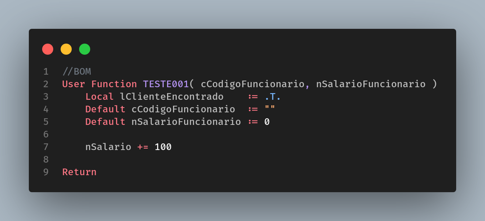

# Declaração de Variáveis

[Voltar](../../README.md)

**SEMPRE** declare uma variável antes de usá-la. Mas não basta declara-la, tem que inseri-la dentro da seção correta. Evite sair declarando variáveis Private no meio do código demasiadamente por preguiça, pois uma hora isso poderá te complicar (declarando uma variável Private em um PE a chance de nomear e alterar o comportamento de uma variável já existente torna-se maior do que imagina). Prefira o uso de variáveis locais e sua utilização por parâmetros via ponteiro **(@)**.

