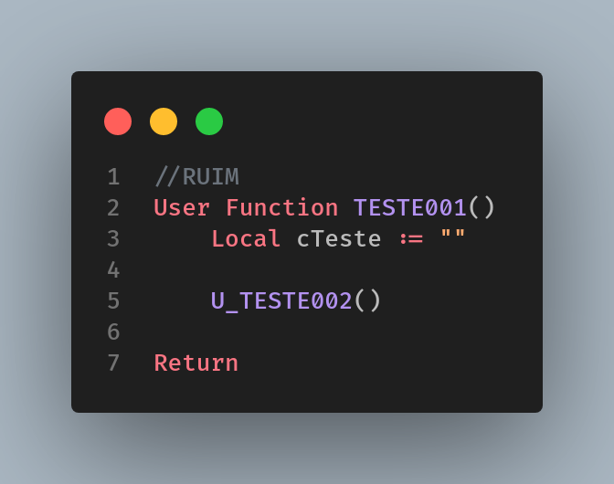
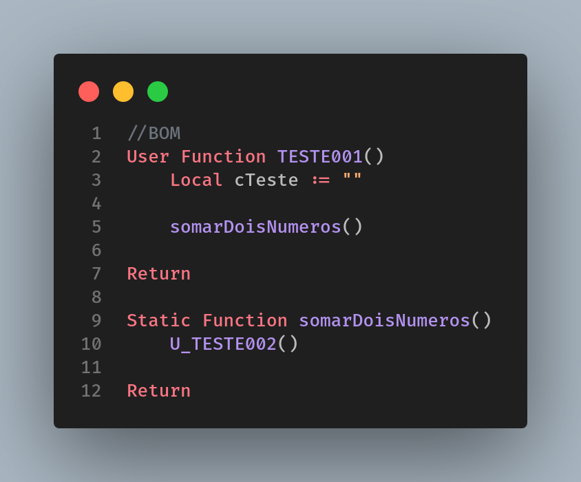

# Encapsulamento de Funções

[Voltar](../../README.md)

É comum realizarmos a chamada de User Function em outros programas, mas concordam comigo que nenhum desenvolvedor merece ter que navegar até a função chamada para descobrir o que a mesma faz? Para isso recomenda-se o uso do encapsulamento do código, para mascarar de uma maneira mais intuitiva qual sua finalidade.

Nesse trecho, não sabemos o que significa o _U_TESTE002_ tampouco o que ela faz, obrigando o DEV a ter que navegar até o código origem só para saber sua finalidade:

Por outro lado, nesse trecho sabemos que a função _U_TESTE002()_ é responsável por realizar a soma de dois números, uma vez que sua chamada foi encapsulada dentro da _Static Function_ com um nome completamente sugestivo, facilitando assim a análise do desenvolvedor:

