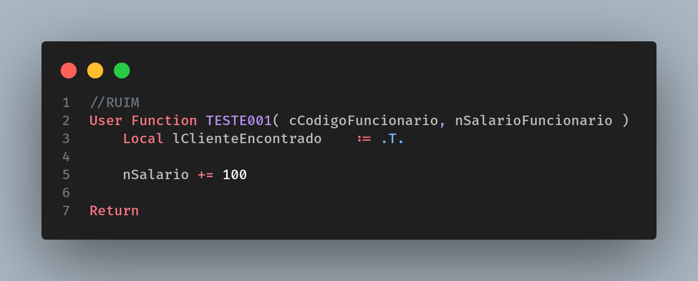
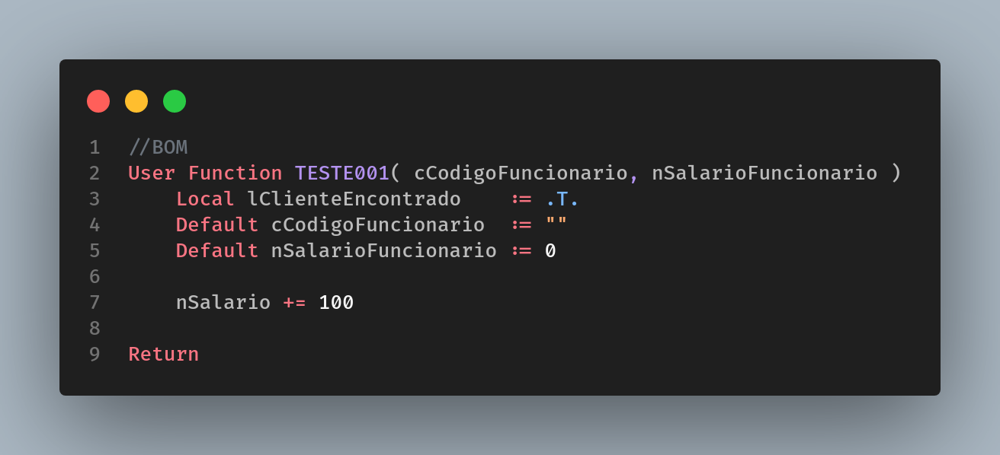

# Escopo Default

Para variáveis passadas por parâmetro, use e abuse do default, isso te poupará tempo identificando problemas de variáveis que não foram passadas por parâmetro ocasionando em erros de tipagem.

Nesse caso, se o desenvolvedor chamar essa função esquecendo de passar o valor para nSalarioFuncionario teremos um erro na rotina, pois ao tentar acrescentar o valor de 100 ao salário o sistema dará problema de tipagem, uma vez que, a variável estará com o tipo Nil.
