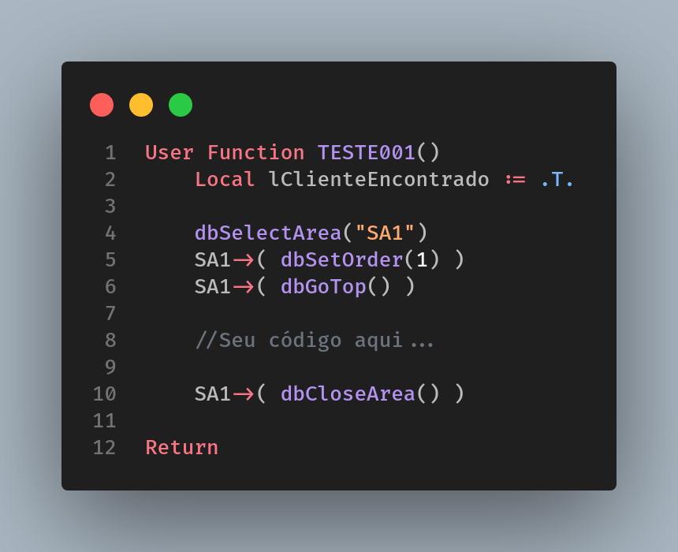
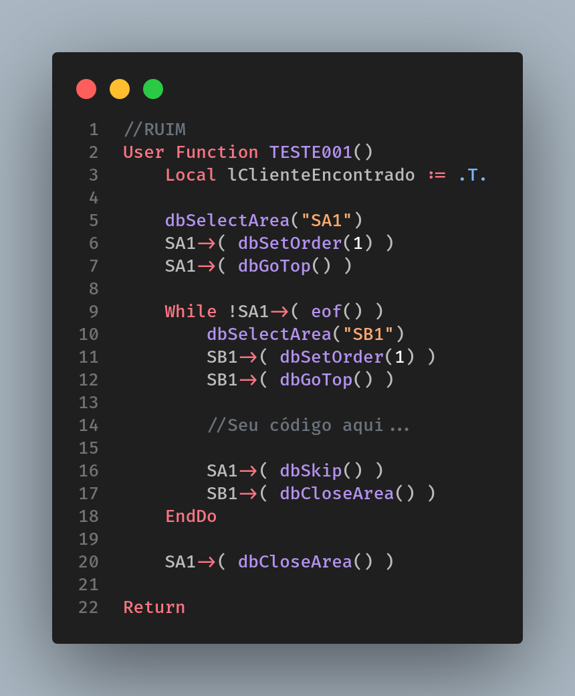
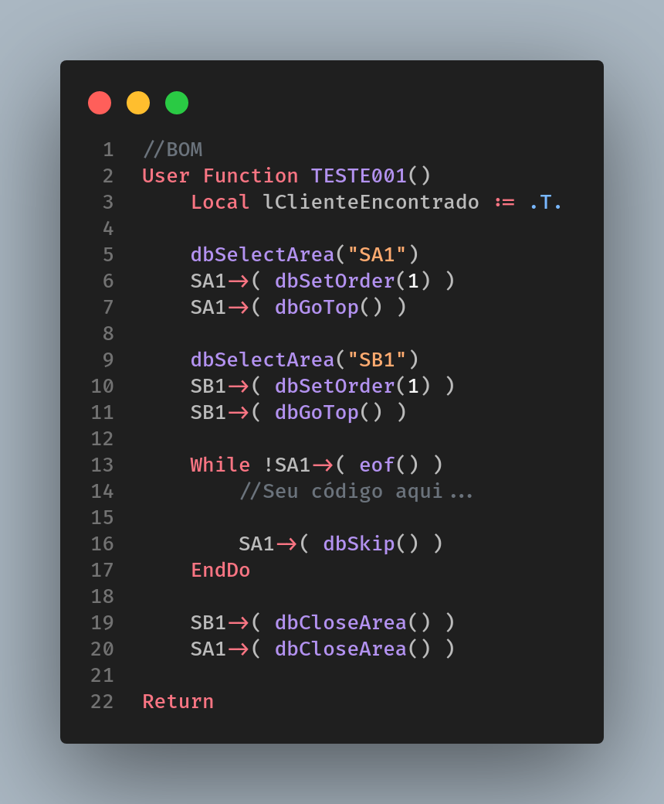
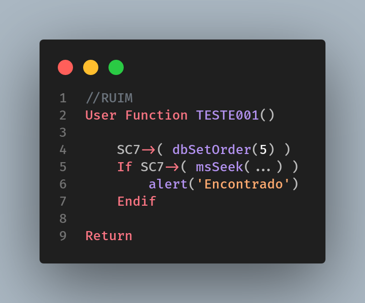
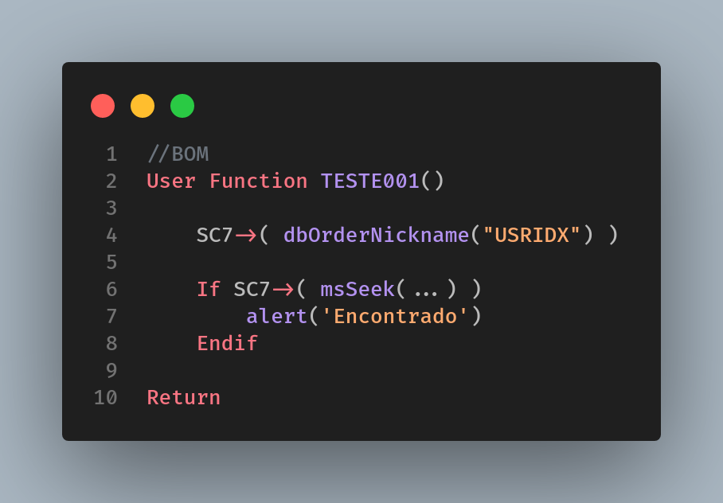
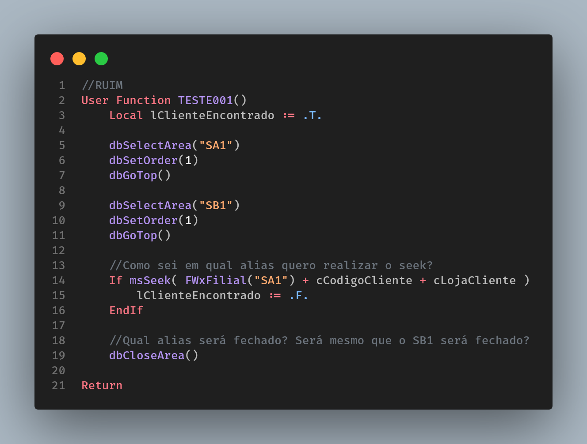
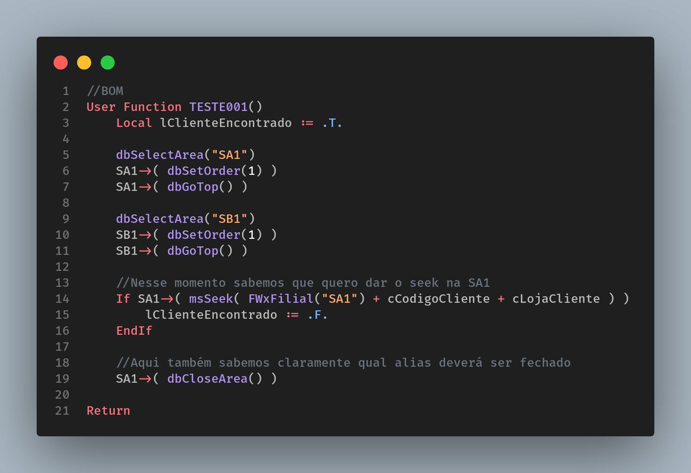

# Funções DB

Para funções _db_ segue uma série de recomendações:

1. Para todo dbSelectArea, utilizar um _dbCloseArea_ a fim de evitar estouro de memória devido a quantidade máxima de áreas em aberto (1024).

2. Evite o uso do _dbSelectArea_ dentro de laços de repetições, pois conforme dito no exemplo anterior, se esquecer de fechar a área em um laço que percorra muitos registros dará estouro de memória.

3. Para índices personalizados utilizar a função _dbNickName_ ao invés de _dbsetOrder_, pois podemos correr o risco de um novo índice ser criado pela Totvs e sobreescrever a posição em que seu índice foi criado, impactando diretamente no código. Veja os exemplos abaixo:

- 3.1 - Imagine que nesse primeiro cenário você criou o indice 5 para atender a uma determinada _feature_ que ficou responsável por desenvolver, porém, meses depois seu cliente decidiu rodar algum pacote para atualizar a base, e nesse pacote foi adicionado pela Totvs tambem um indice 5 o que aconteceria? Exatamente, seu indice passaria a ser a próxima ordem disponível (no caso do exemplo o 6) e o indice 5 seria sobreescrito pelo pacote da Totvs. Com isso sua feature começaria a dar problemas pois a ordem dos campos provavelmente seria a mesma.

- 3.2 - Já nesse outro exemplo utilizamos o _dbOrderNickName_ para que a ordem seja buscada sempre pelo apelido do indice e não pela sua ordem, com isso, independente de qual posição seu indice ocupe sua aplicação sempre estará funcionando, te garantindo umas boas horas de sono...

 

4. Para a utilização de funções db (dbSetOrder, dbGoTop, dbCloseArea, dbSkip etc) utilizar sempre a referência da tabela. Sem isso existe grande chance do Protheus se perder e tentar acessar um campo de outra tabela aberta no mesmo fonte.

5. Caso utilize o comando _dbSeek_ para busca de um registro atente-se sempre a usar o _dbGoTop_, pois diferente do _msSeek_, o dbSeek não costuma levar o cursor para o primeiro registro.
