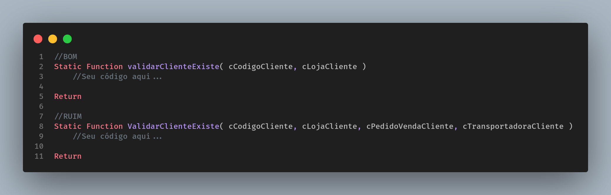
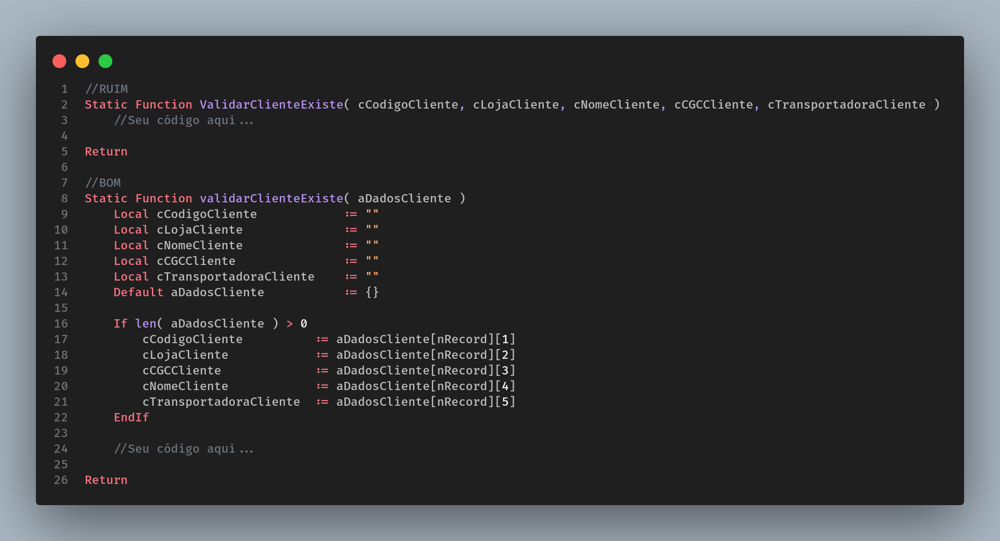

# Funções

[Voltar](../../README.md)

### **Parâmetros**

Dizemos no Clean Code, que uma função não pode possuir muitos parâmetros, pois quanto mais parâmetros, maior a chance daquela função estar executando mais de um comportamento. Por isso o recomendado é que a cada função o número máximo de parâmetros informado seja de 3.

Lembrando que isso **NÃO** é uma regra, fazemos isso apenas para garantir a legibilidade do código.

Vejam o exemplo abaixo:



A chance do desenvolvedor se perder na chamada dessa _Static Function_ é enorme, pois a quantidade de parâmetros passado é extensa e existe um enorme possibilidade da função estar executado mais de uma funcionalidade.
Lembrem-se, funções bem escritas precisam ser modulares e fáceis de levar de um lugar ao outro.

Mas, e se eu tenho uma função com um único comportamento que demande receber muitas informações, como por exemplo dados para executar uma rotina ExecAuto? Para isso use e abuse dos arrays ou até mesmo objetos em JSON.



### **Nomenclatura**

O padrão mais utilizado para nomenclatura de _Static Functions_ é o Camel Case, que consiste em ter a primeira letra da função mínuscula e a cada quebra de palavra, separa-la com uma letra maiúscula.
Por exemplo:

```
Static Function bloquearClientesInadimplentes() //GOOD
Static Function BLOQUEARCLIENTESINADIMPLENTES() //BAD
```
