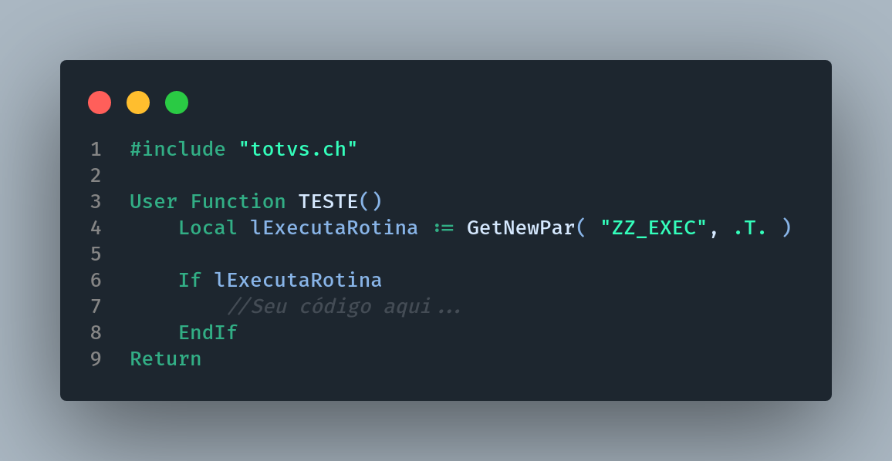

# Liga/Desliga

[Voltar](../../README.md)

Imagine que você esteja trabalhando em uma nova feature para seu cliente, porém, além de ser uma feature complexa, será desenvolvida no core de um módulo chave. E com isso você precisa garantir que a entrada da feature em produção não pare a operação de seu cliente, e em caso de erros fazer rollback será algo moroso e estressante. Para isso prefira o uso de variáveis de liga/desliga. Mas o que são elas?

Variáveis liga/desliga, são variáveis alimentadas por um parâmetro do tipo lógico em que permite a execução ou não de uma determinada rotina, deixando o controle totalmente nas mãos do analista.

Veja o exemplo abaixo:

Note que no começo da função temos um parâmetro lógico que é atribuido a uma variável que faz o controle da execução da rotina. Onde, caso seja .T. a rotina será executada normalmente, e caso seja .F. a rotina não será executada. Dessa forma fica muito mais ágil realizar a retirada de uma feature que esteja ocasionando problemas no sistema.
