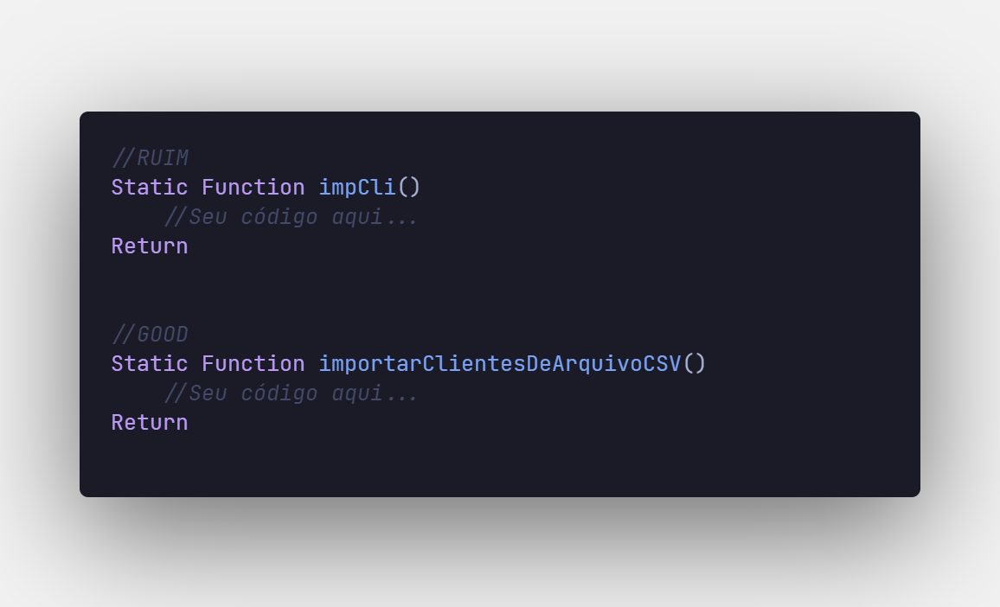

# Nomenclaturas

Sabemos que o ADVPL possui como característica uma limitação quanto a nomenclatura de variáveis e funções (limitação essa que caiu com o surgimento do TLPP). Todavia, o objetivo desse tópico está em abordarmos o uso do Clean Code deixo aqui algumas dicas que sigo ao decorrer de desenvolvimentos (não se trata de um padrão convencional da TOTVS):

Nesse caso não devemos olhar para as limitações que a linguagem nos impõe e sim saber abreviar ou escrever de forma inteligente.

### **Variáveis**

### **Funções**

Nota-se que no exemplo acima excedemos o limite máximo, mas concordam que a legibilidade do nome da função e das variáveis ficou bem melhor do que se estivesse abreviado?