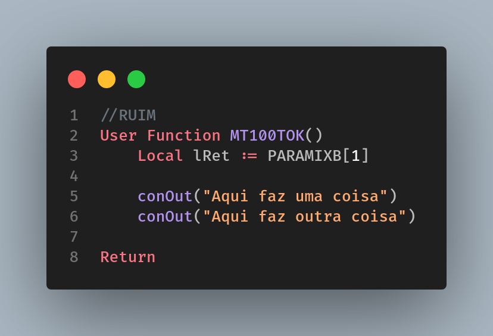
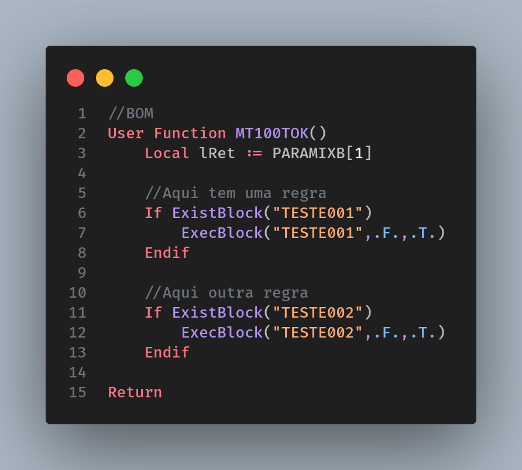

# Pontos de Entrada

[Voltar](../../README.md)

Ao criar um ponto de entrada, evite codificar a regra de negócio dentro do Ponto de Entrada. Para isso deverá ser criada uma User Function e usá-la via ExistBlock e ExecBlock dentro do PE.

Notem que da forma acima várias regras de negócio se misturaram em um único fonte.

Para fazer de uma forma legível, prefira quebrar em outras _User Functions_ cada uma em um arquivo diferente e chama-las via ExecBlock, como no exemplo a seguir:

