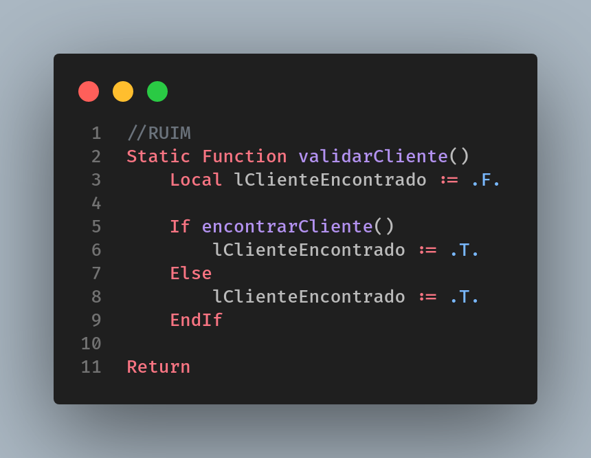

# Else

O uso excessivo do Else também pode trazer complexidade desnecessária ao código.

Notem que além de reduzir a complexidade no segundo exemplo, conseguimos reduzir a quantidade de linhas no código. Lembrem-se um código bom escrito deve ser sucinto e objetivo.
