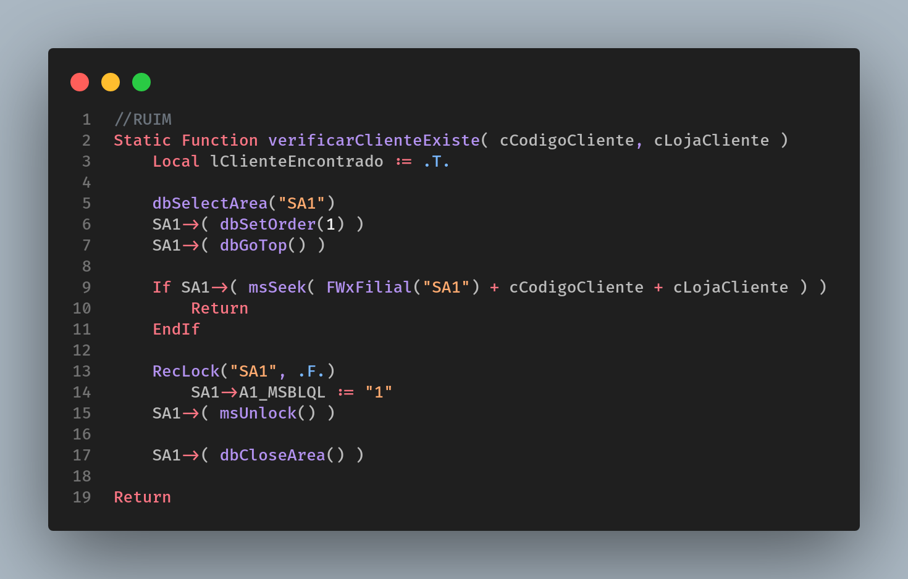
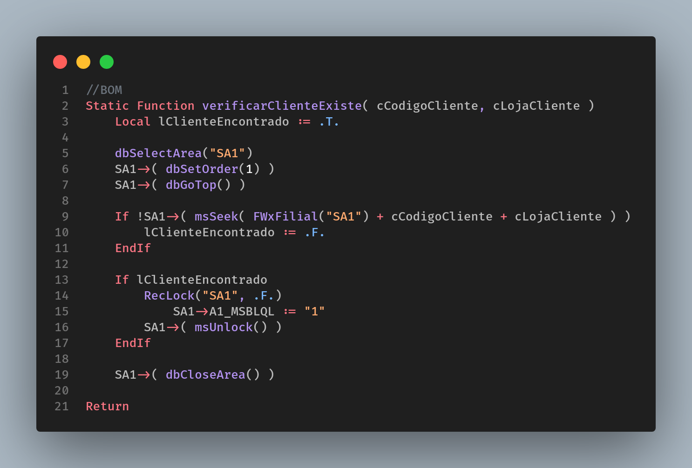

# Uso do Return

Todo programa deve ter apenas um início e um fim, e com o AdvPL não é diferente. Prefira variáveis de controle a inserir Return no meio do código fonte e correr o risco de deixar de executar uma função importante para a rotina.

Seu código deve ser linear:

