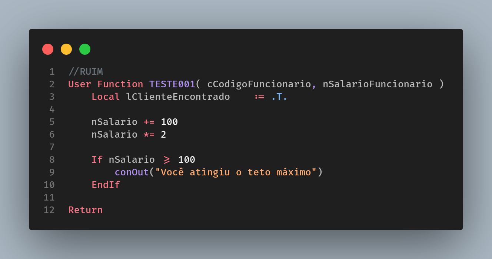
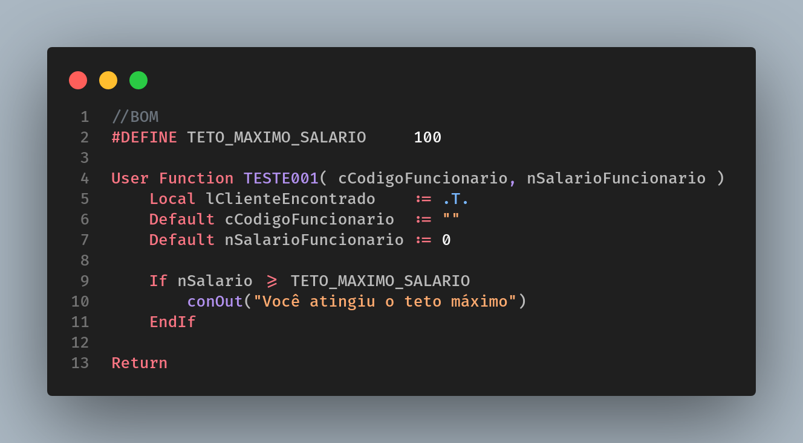

# Valores mágicos

[Voltar](../../README.md)

Assim como um espectador não é obrigado a saber como é feito um número de mágica, você também não é obrigado a perder horas de análise identificando o que um valor representa. Ao utilizar informações fixas, evite “joga-las” direto no fonte, prefira o uso de constantes com um nome sugestivo, facilitando a análise de outro desenvolvedor. Notem abaixo a diferença na interpretação de um fonte com um valor bem representado para um fonte com um valor simplesmente informado.

